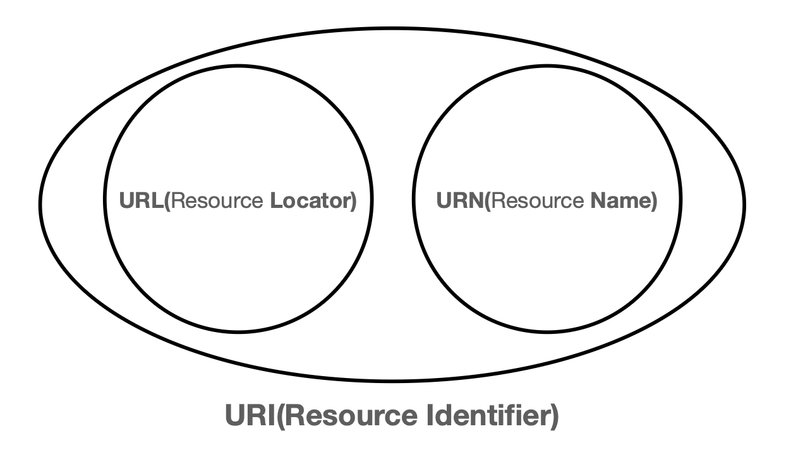

# #3. URI와 웹 브라우저 요청 흐름

## URI (Uniform Resource Identifier)

- Uniform : 리소스를 식별하는 통일된 방식
- Resource : 자원, URI로 식별할 수 있는 모든 것 (제한 없음)
- Identifier : 다른 항목과 구분하는데 필요한 정보

<br />

#### URI vs URL vs URN



- URI는 로케이터(locator), 이름(name) 둘 다 추가로 분류될 수 있다.
- URI : 리소스를 식별, URL과 URN의 조합
- URL(Uniform Resource Locator) : 리소스가 있는 위치를 지정  
   → 위치는 변할 수 있지만, 이름은 변하지 않는다.
- URN(Uniform Resource Name) : 리소스에 이름을 부여  
   → URN 이름만으로 실제 리소스를 찾을 수 있는 방법이 보편화 되지 않음
- URN은 거의 쓰지 않고, URL만 사용함
- 이후에는 URI를 URL과 같은 의미로 이야기

<br />

#### URL 분석

```
https://www.google.com/search?q=hello&hl=ko
```

- 프로토콜 : `https`
- 호스트명 : `www.google.com`
- 포트번호 : `443`
- 경로 or 패스 : `/search`
- 쿼리 파리미터 : `q=hello&hl=ko`

<br />

### URL 구성요소

```
scheme://[userinfo@]host[:port][/path][?query][#fragment]
```

#### URL scheme

- 주로 프로토콜 사용
- 프로토콜이란 어떤 방식으로 자원에 접근할 것인가 하는 약속 규칙  
  ex) http, https, ftp 등등
- http는 80포트, https는 443포트를 주로 사용, 포트는 생략 가능
- https는 http에 보안 추가 (HTTP Secure)

#### URL userinfo

- URL에 사용자정보를 포함해서 인증
- 거의 사용하지 않음

#### URL host

- 호스트명
- 도메인명 또는 IP주소를 직접 사용가능

#### URL PORT

- 포트(PORT)
- 접속 포트
- 일반적으로 생략, 생략시 http는 80, https는 443

#### URL path

- 리소스 경로(path), 계층적 구조
- 예)  
   /home/file1.jpg  
   /members  
   /members/100, /items/iphone12

#### URL query

- key=value 형태
- ?로 시작, &로 추가 가능 : `?keyA=valueA&keyB=valueB`
- query parameter, query string 등으로 불림, 웹서버에 제공하는 파라미터, 문자 형태

#### URL fragment

- html 내부 북마크 등에 사용
- 서버에 전송하는 정보 아님

<br />

## 웹 브라우저 요청 흐름

#### 주소창에 URL을 쳤을 때의 동작 과정

```
https://www.google.com:443/search?q=hello&hl=ko
```

1. `www.google.com`의 DNS 서버 조회 → IP: 200.200.200.2
2. https 포트 생략 → 포트 정보: 443
3. 웹 브라우저가 HTTP 요청 메시지 생성
   ```
   GET /search?q=hello&hl=ko HTTP/1.1
   Host: www.google.com
   ```
4. SOCKET 라이브러리를 통해 TCP/IP 연결 후 데이터 전달
5. HTTP 메시지가 포함되어 있는 TCP/IP 패킷 생성
6. 서버에서 메시지를 보고 HTTP 응답 메시지를 생성해서 클라이언트에게 돌려줌

   ```
   HTTP/1.1 200 OK
   Content-Type: text/html;charset=UTF-8        // 응답 데이터의 형식 (html 등)
   Content-Length: 3423                         // 응답 데이터의 길이

    <html>
        <body>...</body>
    </html>
   ```

7. 클라이언트가 html 데이터를 받으면 웹 브라우저에서 랜더링을 해준다.
